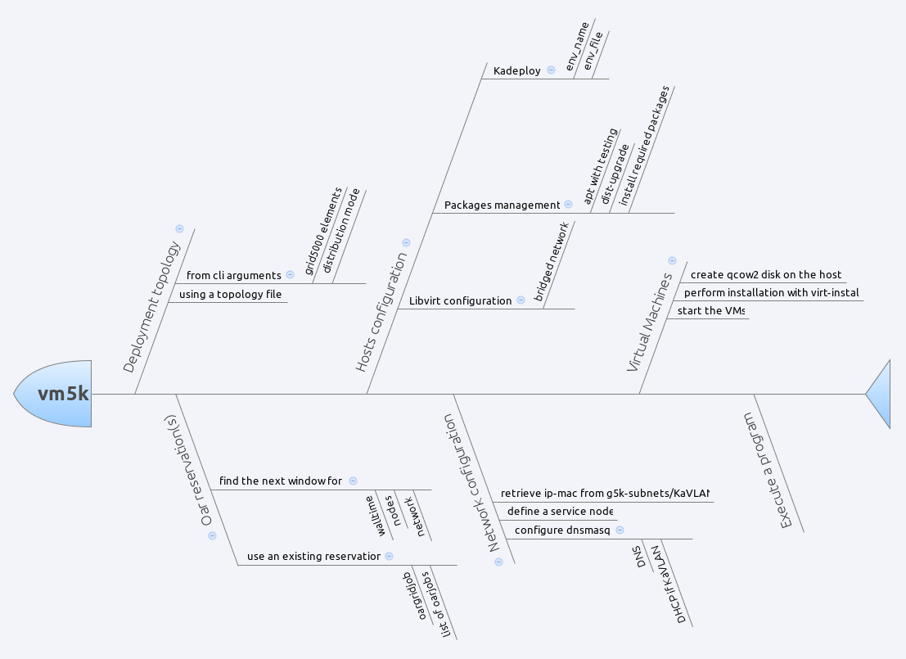

*******************************************
vm5k: automatic virtual machines deployment
*******************************************

Vm5k is a tool used to deploy a large number of virtual machines 
on the Grid'5000 platform. It provides several options to customize your 
environments and topology.

Workflow
--------

* define a deployment **topology** on Grid'5000:

  * distributed virtual machines using a template and a list of clusters/sites
  * or from a given xml file (see example below)
  
* manage the **reservation**:

  * find the next window available for the deployment
  * or use an existing reservation

* install the **hosts**

  * deployment of a kadeploy environment name/file
  * upgrade the hosts and configure libvirt
  * create the backing file for the virtual machine

* configure the **network**

  * determine the parameters from the oar/oargridjob
  * generate dnsmasq configuration

* deploy the **virtual machines**

  * create the qcow2 disks on the hosts
  * perform installation with virt-install
  * start the virtual machines

* execute a **program** on the frontend

Basic usage
-----------

The basic usage is to create a certain number of virtual machines on Grid'5000.
To deploy 100 VMs on *wheezy-x64-base* hosts and with the *wheezy-x64-base.qcow2* KVM image
on any Grid5000 cluster with hardware virtualization, for 2 hours::

  vm5k --n_vm 100 -w 2:00:00

This will automatically find free nodes on Grid'5000 that can sustains your virtual
machines, perform the reservation and deploy hosts and VMs automatically.

Choose a distribution for the VMs
^^^^^^^^^^^^^^^^^^^^^^^^^^^^^^^^^

Default distribution follow a ``round-robin`` mechanism, i.e. adding vm to host while cycling around
them and checking that it can sustain more VM. But you may want to have a the same number of VMs on
all hosts. For that use ``n_by_hosts``::

  vm5k -r grid5000:20 -n 100 -d n_by_hosts
  
You can also have a ``concentrated`` distribution meaning that next host will be used when 
the previous one cannot sustain more VM, i.e. have enough memory to start it:: 

  vm5k -r grid5000:20 -n 100 -d concentrated

To control more finely the distribution, you must use the infile option, that is described in
`Topology file <http://vm5k.readthedocs.org/en/latest/vm5k.html#use-a-topology-file>`_. 
A generated one can be found in vm5k outdir after deployment or in examples directory of 
vm5k package.
 
 
Select the hosts hardware 
^^^^^^^^^^^^^^^^^^^^^^^^^

If you want to test your application on a specific hardware (CPU, RAM, ...), you can select the 
Grid'5000 elements you want to use by giving a list of cluster or sites::

 vm5k --n_vm 100 -r hercule,griffon,graphene  -w 2:00:00

or select the number of hosts you want on each element::

 vm5k --n_vm 100 -r taurus:4,nancy:10 -w 2:00:00
 
See https://www.grid5000.fr/mediawiki/index.php/Special:G5KHardware for 
more details on the cluster hardware.

Define the VMs template 
^^^^^^^^^^^^^^^^^^^^^^^

You can customize the virtual machines components by defining a template::

 vm5k --n_vm 20 --vm_template '<vm mem="4096" hdd="10" n_cpu="4" cpuset="auto"/>' 
 
or using `Topology file <http://vm5k.readthedocs.org/en/latest/vm5k.html#use-a-topology-file>`_. 

Launch a program after the deployment
^^^^^^^^^^^^^^^^^^^^^^^^^^^^^^^^^^^^^

If you already have an experimental script that must be run on the deployed hosts and VMs,
you can use -p option::

 vm5k --n_vm 100 -p myscript.sh -o myxp
 
You can access the list of hosts and VMs in myxp directory in simple csv or in XML format.
Have a look to the file vm5k/examples/boot_time.py for a simple example in Python.

.. literalinclude::../examples/boot_time.py

Advanced usage
--------------

Use an existing job
^^^^^^^^^^^^^^^^^^^

You may use an existing reservation::

 vm5k --n_vm 100 -j 42895 
 vm5k --n_vm 10 -j grenoble:1657430
 vm5k --n_vm 45 -j grenoble:1657430,toulouse:415866,rennes:673350
 
It will retrieve the hosts that you have, deploy and configure them, and finally 
distribute the VMs on them.

You can also know how many VMs can be run on a list of hosts (checking RAM availability)
using::

 vm5k_max_vms -j 42895 -t '<vm mem="2048" hdd="10" cpu="4" cpuset="auto"/>'

Customize the environments of the hosts and VMs
^^^^^^^^^^^^^^^^^^^^^^^^^^^^^^^^^^^^^^^^^^^^^^^

To perform your experiments, you may want to use specific environments to test the effect of 
various configurations (distribution version, kernel parameters, vm disk, ...). You can 
choose hosts operating system with::

 vm5k --n_vm 50 --walltime 2:00:00 --env_name wheezy-x64-prod
 vm5k --n_vm 50 --walltime 2:00:00 --env_name user:env_name
 vm5k --n_vm 50 --walltime 2:00:00 --env_file path/to/your/env_file

You may also want to use your virtual machines disk::

 vm5k --n_vm 50 --walltime 2:00:00 --vm_backing_file path_to_my_qcow2_file_on_g5k
 
For more complex situtation, i.e. using different backing_file for the VMs, you need to use the XML 
:ref:`topology_file`.

Deploy in an isolated vlan 
^^^^^^^^^^^^^^^^^^^^^^^^^^

Grid'5000 offers the possibility of using KaVLAN to deploy your nodes in an isolated VLAN,  
https://www.grid5000.fr/mediawiki/index.php/Network_isolation_on_Grid%275000. You can 
use it in vm5k with::

 vm5k --n_vm 100 -r reims -w 2:00:00 -k
 vm5k --n_vm 100 -r taurus:4,nancy:10 -w 2:00:00 -k
 vm5k --n_vm 600 -r grid5000:100 -w 2:00:00 -k -b reims

When using global kavlan, i.e. a isolated VLAN on multiple sites, you must blacklist
reims due to `bug 4634 <https://intranet.grid5000.fr/bugzilla/show_bug.cgi?id=4634>`_

Use a topology file
^^^^^^^^^^^^^^^^^^^
.. _topology_file:

To have the finest control on the deployment topology, you can use an input file that described the 
topology and VMs
characteristics::

 vm5k -i topology_file.xml -w 6:00:00

where `topology_file.xml` is:

.. literalinclude:: infile.xml
  
  
Options
-------

Execution
^^^^^^^^^

Manage how vm5k is executed

  -h, --help            show this help message and exit
  -v, --verbose         print debug messages
  -q, --quiet           print only warning and error messages
  -o OUTDIR, --outdir OUTDIR
                        where to store the vm5k log files
                        default=vm5k_20140307_013045_+0100
  -p PROGRAM, --program PROGRAM
                        Launch a program at the end of the deployment
  --plot                draw a topological graph of the deployment

Mode
^^^^

Define the mode of vm5k

  -n N_VM, --n_vm N_VM  number of virtual machines
  -i INFILE, --infile INFILE
                        XML file describing the placement of VMs on G5K sites and clusters
  -j JOB_ID, --job_id JOB_ID
                        use the hosts from a oargrid_job or a oar_job.
  -w WALLTIME, --walltime WALLTIME
                        duration of your reservation
  -k, --kavlan          Deploy the VMs in a KaVLAN

Physical hosts
^^^^^^^^^^^^^^

Tune the physical hosts.

  -r RESOURCES, --resources RESOURCES
                        list of Grid'5000 elements
  -b BLACKLISTED, --blacklisted BLACKLISTED
                        list of Grid'5000 elements to be blacklisted
  -e ENV_NAME, --env_name ENV_NAME
                        Kadeploy environment name
  -a ENV_FILE, --env_file ENV_FILE
                        path to the Kadeploy environment file
  --forcedeploy         force the deployment of the hosts
  --nodeploy            consider that hosts are already deployed and configured
  --host-packages HOST_PACKAGES
                        comma separated list of packages to be installed on the hosts

Virtual machines
^^^^^^^^^^^^^^^^

Tune the virtual machines.

  -t VM_TEMPLATE, --vm_template VM_TEMPLATE
                        XML string describing the virtual machine
  -f VM_BACKING_FILE, --vm_backing_file VM_BACKING_FILE
                        backing file for your virtual machines
  -l VM_DISK_LOCATION, --vm_disk_location VM_DISK_LOCATION
                        Where to create the qcow2: one (default) or all)
  -d VM_DISTRIBUTION, --vm_distribution VM_DISTRIBUTION
                        how to distribute the VMs distributed (default) or concentrated
  --vm-clean-disks      force to use a fresh copy of the vms backing_file

